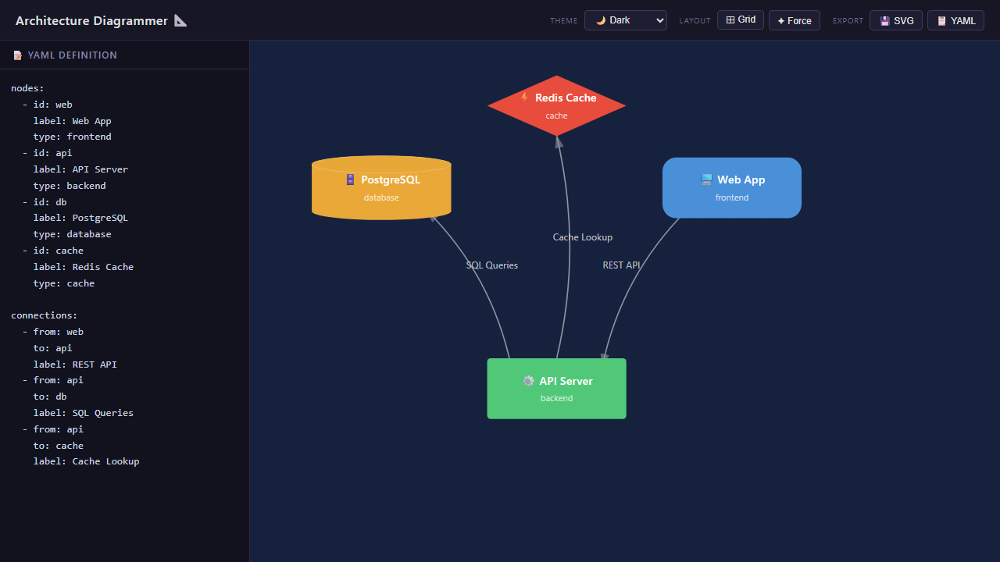

# Architecture Diagrammer 📐

Turn YAML into interactive architecture diagrams — right in your browser.

🌐 **[Live Demo](https://vineeththomasalex.github.io/architecture-diagrammer/)**



## Features

- **YAML-to-Diagram** — Define your architecture in simple YAML and see it rendered instantly as an SVG diagram
- **Drag to Rearrange** — Click and drag any node to reposition it on the canvas
- **Themes** — Switch between Dark, Light, and Blueprint themes
- **Auto Layout** — Arrange nodes automatically with Grid or Force-directed layouts
- **SVG Export** — Download your diagram as a standalone SVG file
- **Copy YAML** — Copy the current YAML definition to your clipboard

## YAML Format

Diagrams are defined with two top-level keys: `nodes` and `connections`.

```yaml
nodes:
  - id: web
    label: Web App
    type: frontend
  - id: api
    label: API Server
    type: backend
  - id: db
    label: PostgreSQL
    type: database

connections:
  - from: web
    to: api
    label: REST API
  - from: api
    to: db
    label: SQL Queries
```

### Node Properties

| Property | Required | Description |
|----------|----------|-------------|
| `id`     | Yes      | Unique identifier for the node |
| `label`  | Yes      | Display name shown on the diagram |
| `type`   | No       | Node type (affects shape and color) |

### Connection Properties

| Property | Required | Description |
|----------|----------|-------------|
| `from`   | Yes      | `id` of the source node |
| `to`     | Yes      | `id` of the target node |
| `label`  | No       | Text displayed on the connection |

### Node Types

| Type       | Shape          | Color   | Icon |
|------------|----------------|---------|------|
| `frontend` | Rounded rect   | Blue    | 🖥️   |
| `backend`  | Rectangle      | Green   | ⚙️   |
| `database` | Cylinder        | Orange  | 🗄️   |
| `queue`    | Rectangle      | Purple  | 📨   |
| `cache`    | Diamond        | Red     | ⚡   |
| `external` | Dashed outline | Grey    | 🌐   |

## Tech Stack

- **React 19** — UI framework
- **TypeScript** — Type-safe development
- **SVG** — Diagram rendering with interactive drag support
- **Vite** — Build tooling and dev server
- **js-yaml** — YAML parsing
- **Playwright** — End-to-end testing

## Getting Started

```bash
# Install dependencies
npm install

# Start dev server
npm run dev

# Build for production
npm run build

# Preview production build
npm run preview

# Run tests
npx playwright test
```

## Testing

```bash
# Install Playwright browsers (first time only)
npx playwright install chromium

# Run all end-to-end tests
npx playwright test

# Run tests with UI
npx playwright test --ui
```

## License

MIT
